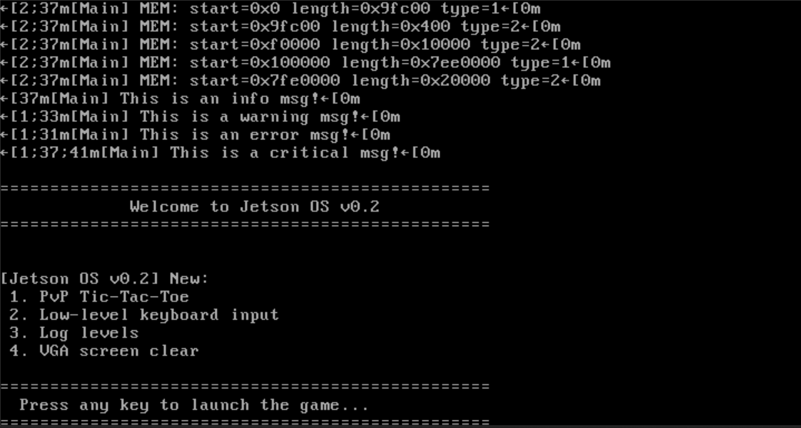
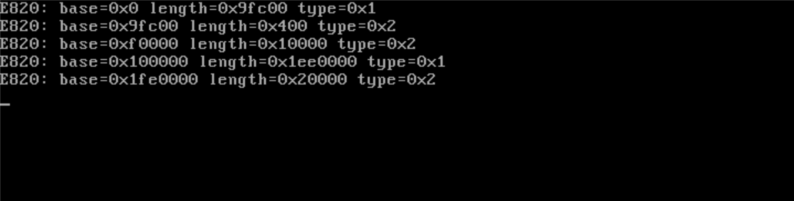

# 🧠 Jetson Operating System

<p align="center">
 
</p>

<p align="center">
 
</p>

A bootable x86 operating system built from scratch using Assembly and C, following a structured step-by-step OS development guide.  
Includes a custom bootloader, FAT12 filesystem loader, memory logging display, VGA output, and printf() support—all running inside QEMU.

> Author / Maintainer: Justin Thomas

---

## 📌 Overview

This project is a hands-on exploration of low-level systems programming and OS internals. By implementing each component—from the 16-bit bootloader to the C-based kernel—you gain a deep understanding of how hardware and software interact at the bare-metal level.

---

## 🛠️ What I Built

This operating system project includes the following key components and features:

- A **custom BIOS-compatible bootloader** written in Assembly that initializes the system.
- A **FAT12 filesystem loader** capable of reading disk sectors and traversing subdirectories.
- A **C-based kernel** that takes over after bootloader execution.
- A **minimal printf() implementation** using `va_list` for formatted output.
- **VGA text output** for displaying information directly on the screen via the VGA buffer.
- A **memory log display** that shows BIOS-provided memory maps and diagnostics during boot.
- An automated **build system using SCons** for compiling and linking all components.
- Integration with **QEMU** for emulation and testing of the bootable disk image.

---

## 🛠️ Features Implemented

| Feature                  | Description                                         |
|--------------------------|-----------------------------------------------------|
| ✅ Bootloader            | Custom BIOS-compatible bootloader in Assembly       |
| ✅ Disk Reading (INT 13h) | Sector-based disk access using BIOS interrupts      |
| ✅ FAT12 Filesystem      | FAT12 support with subdirectory traversal            |
| ✅ Kernel in C           | Bootloader hands control to a C-based kernel         |
| ✅ printf()              | Minimal printf() implemented using va_list           |
| ✅ VGA Text Output       | Writes text in real mode via VGA buffer (0xB8000)    |
| ✅ Memory Log Display    | Displays BIOS-provided memory map and diagnostics    |
| ✅ Build System          | Automated with SCons                                  |
| ✅ QEMU Integration      | Bootable disk image tested in QEMU                    |

---

## 📂 Directory Structure

.
├── bootloader/       # Stage1 & Stage2 bootloader (ASM + C)  
├── kernel/           # Core kernel code (C and ASM)  
├── fs/               # FAT12 parsing library  
├── libs/             # Minimal stdio, string, and utility libraries  
├── toolchain/        # GCC cross-compiler setup scripts  
├── image/            # SCons scripts for disk formatting & mounting  
├── build/            # Output: kernel.elf and image.img  
├── scripts/          # run.sh to launch QEMU  
├── SConstruct        # Top-level SCons build script  
└── README.md         # This file  

---

## ⚙️ Development Environment

- OS: Ubuntu (via WSL or native Linux)  
- Compiler Toolchain: Custom i686-elf-gcc cross-compiler  
- Emulator: QEMU (qemu-system-i386)  
- Image Tools: libguestfs, guestmount, supermin  
- Build System: SCons  

---

## 🧪 Setup & Usage

1. Install toolchain  
```bash
cd toolchain
bash setup.sh
```

2. Build the OS  
```bash
scons
```

3. Run in QEMU  
```bash
sudo ./scripts/run.sh disk build/i686_debug/image.img
```

*Note: sudo is required for guestmount during image creation.*

---

## 🧠 Concepts Demonstrated

- BIOS interrupt programming (INT 13h, INT 10h)  
- Real-mode to protected-mode bootstrapping  
- Sector I/O and FAT12 filesystem parsing  
- Memory-mapped VGA text rendering  
- Custom printf() with variable arguments  
- BIOS memory map logging and display  
- Bare-metal C kernel without libc  
- Automated image creation and QEMU testing  

---

## 🎯 Planned Future Additions

- ⌨️ PS/2 keyboard input and interrupt handling  
- 🐚 Basic shell interface (CLI)  
- 📦 Dynamic memory allocator (heap and paging)  
- 🧱 Protected-mode enhancements  
- 🔁 Simple task scheduler for multitasking  

---

## ✅ What I’ve Learned

- End-to-end OS bootloader and kernel startup  
- Low-level disk I/O and filesystem implementation  
- BIOS interrupt interaction  
- Implementing a minimal C runtime and printf()  
- Debugging bare-metal code with QEMU and E9 serial output  
- Build automation for cross-platform bare-metal development  

---

## 📝 License

This project is developed and maintained by Justin Thomas for educational purposes.

---

## 🔍 Acknowledgements

Inspired by community tutorials and open-source OSDev resources. Special thanks to all authors and contributors whose guides made this learning journey possible.
