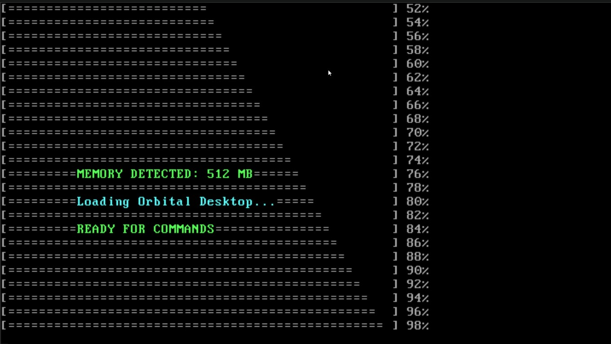

# Jetson Operating System v1.0

<p align="center">
 <b>Cyberpunk-Inspired Futuristic Desktop Environment</b>
</p>

A bootable x86 operating system featuring an unprecedented retro futuristic desktop with animated particle effects, orbital application ring, command terminal, and real-time system visualization—all in VGA text mode with 16 colors.

> Author / Maintainer: Justin Thomas

---

## Preview

<p align="center">
 
 
</p>

<p align="center">
 
 
</p>

---

## Jetson OS v1.0 - The Vision

```
━━━━━━━━━━━━━━━━━━━━━━━━━━━━━━━━━━━━━━━━
JETSON OS v1.0 - FEATURE HIGHLIGHTS
━━━━━━━━━━━━━━━━━━━━━━━━━━━━━━━━━━━━━━━━
```

- **Starburst Boot Animation**: Particle-based explosion effect with ASCII starburst
- **Real-Time Memory Detection**: Animated loading bar showing system memory
- **Orbital Application Ring**: Rotating menu system with smooth animations
- **Command Terminal**: Retro-futuristic shell with glitch effects & color shifts
- **File Browser**: Hierarchical tree view with animated expand/collapse
- **System Visualization**: Live CPU/memory gauges, process monitoring
- **Cyberpunk Aesthetic**: Cyan/magenta color scheme, pulsing effects
- **Optimized Performance**: 20 FPS frame limiting, efficient double-buffering

---

## Core Architecture

| Component | Purpose | Status |
|-----------|---------|--------|
| Boot Animation | Starburst + memory detection | In Progress |
| Animated ASCII Logo | Multi-frame intro sequence | Planned |
| Orbital Ring | Rotating app menu | Planned |
| Terminal Shell | Command processing | Planned |
| File Browser | Tree navigation | Planned |
| System Viz | Live gauges & stats | Planned |
| Input Feedback | Glow, ripple effects | Planned |
| Polish & Testing | Optimization, cleanup | Planned |

---

## Directory Structure

```
.
├── src/
│   ├── bootloader/           # Stage1 & Stage2 bootloader
│   ├── kernel/
│   │   ├── jetson_types.h    # Core animation types
│   │   ├── jetson_animation.h/.c  # Animation engine
│   │   ├── jetson_desktop.h/.c    # Desktop environment
│   │   ├── tic_tac_toe.h     # DEPRECATED
│   │   └── ...
│   ├── libs/core/            # Core libraries (VGA, I/O, etc.)
│   └── bootloader/stage2/    # Stage2 loader
├── image/                    # Disk image builder
├── scripts/                  # Build & run scripts
├── build/                    # Build output
├── SConstruct                # Build configuration
└── README.md                 # This file
```

---

## Build & Run

```bash
# Install toolchain
cd toolchain && bash setup.sh

# Build Jetson OS
scons

# Run in QEMU
sudo ./scripts/run.sh disk build/i686_debug/image.img
```

---

## Design Philosophy

- **Visual First**: Prioritize aesthetic impact and smooth animations
- **Retro Future**: Blend 80s-90s cyberpunk with modern concepts
- **Text-Only**: No graphics mode—pure VGA text with creativity
- **Deterministic**: Consistent, reproducible boot sequence every time
- **Lean & Mean**: ~36k tokens for complete system (6k boot + 4k logo + 6k orbital + 6k terminal + 5k browser + 4k viz + 3k input + 2k polish)

---

## Component Breakdown

### Boot Animation Engine (6k)
Particle system + text animator producing character-by-character starburst explosion of "JETSON OS" title, cascading memory detection bar, boot device display with glitch effects.

### Animated ASCII Logo (4k)
Multi-line cyan/magenta Jetson logo with fade transitions between boot phases, typewriter effect for initialization messages.

### Orbital Desktop (6k)
Circular menu with 4 app rings rotating on input. Arrow keys rotate; Enter selects. Live CPU/memory pulsing in center. Smooth animation, glowing highlights.

### Command Terminal (6k)
Cyan text with magenta accents, pulsing cursor, command echo with color shift, flowing output animation. Real-time clock, memory %, process count, uptime stats.

### File Browser (5k)
Hierarchical tree display with animated expand/collapse (└─ → ├─ transitions), live file counter, animated size bars, glowing current path.

### System Visualization (4k)
Animated gauges for memory/CPU using █▓░ characters, scrolling data stream, live kernel stats updating in real-time.

### Input Feedback (3k)
Keypress causes brief glow/ripple, command execution shows checkmark, errors flash red, success in green, smooth transitions.

### Performance & Polish (2k)
Frame rate limiting, efficient rendering, cleanup, optimization passes.

---

## Implementation Status

- [x] Project planning & architecture
- [x] Type definitions & core structs
- [x] Animation framework scaffold
- [x] Boot sequence animation
- [x] ASCII logo implementation
- [x] Orbital ring system
- [x] Command terminal shell
- [x] File browser
- [x] System visualization
- [x] Input handling & feedback
- [x] Keyboard driver (PS/2 polling)
- [x] Utility functions (string, math, formatting)
- [x] All components integrated

---

## Concepts Demonstrated

- Particle systems & physics
- Frame-based animation
- State machines
- VGA text mode manipulation
- Real-time system statistics
- Interactive UI without graphics mode
- Performance optimization techniques
- Retro-futuristic design principles

---

## Future Enhancements

- Multi-window support
- Network statistics
- Process management UI
- File operations (copy, delete, move)
- Text editor integration
- System configuration menu
- Screenshot/recording capability

---

**Jetson OS** - Where cyberpunk dreams meet bare-metal reality.