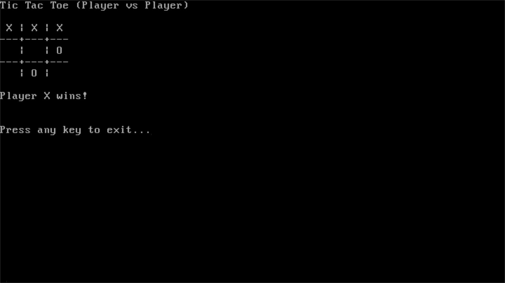

# 🧠 Jetson Operating System

<p align="center">
 
</p>

<p align="center">
 
</p>

A bootable x86 operating system built entirely from scratch using Assembly and C, Jetson OS is a hands-on journey into OS development. It features a multistage bootloader, FAT12 filesystem loader, memory diagnostics display, VGA-based console output, keyboard input, and even a built-in terminal game—all running in QEMU.

> Author / Maintainer: Justin Thomas

---

## 📌 Overview

Jetson OS is designed to teach and demonstrate the internals of an operating system by walking through each level of system interaction. From BIOS interrupt calls and filesystem parsing to C-based kernel development and interactive utilities, this project serves both as a foundational OS and an educational tool.

---

## 🚀 What’s New in Jetson OS v0.2

```
──────────────────────────────────────────────
🆕 Jetson OS Version 0.2 — Feature Highlights
──────────────────────────────────────────────
```

- 🕹️ **Tic-Tac-Toe Game**: A fully interactive, two-player terminal-based game implemented inside the kernel. Designed to showcase user interaction, game logic, and text-based UI on a bare-metal OS.
- ⌨️ **Keyboard Input Support**: Basic PS/2 keyboard support added using polling via I/O ports. Supports ASCII character entry with key release filtering.
- 🪵 **Logging System**: `log_debug`, `log_info`, `log_warn`, `log_err`, and `log_crit` functions added for structured message output, improving kernel diagnostics.
- 📢 **User-Friendly Boot Messages**: A redesigned startup sequence that prints Jetson OS version, boot messages, and update notes before game launch.
- ⏱️ **"Press any key to start" Delay**: A blocking input mechanism added to wait for user input before proceeding to game or shell.
- 🎨 **Formatted VGA Output Enhancements**: Improved formatting in `printf`, including support for `%x`, `%d`, `%s`, and alignment of logs.

---

## 🛠️ Core System Features

| Feature                  | Description                                                    |
|--------------------------|----------------------------------------------------------------|
| ✅ Bootloader            | Custom BIOS-compatible stage1 and stage2 bootloaders (ASM/C)   |
| ✅ Disk Reading (INT 13h)| Low-level disk I/O using BIOS interrupts                        |
| ✅ FAT12 Filesystem      | FAT12 parsing and file reading with subdirectory traversal      |
| ✅ Kernel in C           | Modular kernel written in C with system initialization logic    |
| ✅ printf()              | Variadic formatted output for both console and log streams      |
| ✅ VGA Text Output       | Direct screen manipulation using memory-mapped VGA buffer       |
| ✅ Memory Log Display    | Logs BIOS memory map (via INT 15h, E820) to help debugging      |
| ✅ Keyboard Input        | Polling-based PS/2 input with scan code filtering               |
| ✅ Terminal Game         | Built-in Tic-Tac-Toe game using raw kernel input/output         |
| ✅ Logging API           | Colored and leveled logging for debug and runtime analysis      |
| ✅ QEMU Integration      | Seamless boot and test environment via QEMU                     |

---

## 📂 Directory Structure

.
├── bootloader/       # Stage1 & Stage2 bootloader (ASM + C)  
├── kernel/           # Core kernel code (C and ASM)  
├── fs/               # FAT12 parsing library  
├── libs/             # Minimal stdio, string, and utility libraries  
├── toolchain/        # GCC cross-compiler setup scripts  
├── image/            # SCons scripts for disk formatting & mounting  
├── build/            # Output: kernel.elf and image.img  
├── scripts/          # run.sh to launch QEMU  
├── SConstruct        # Top-level SCons build script  
└── README.md         # This file  

---

## ⚙️ Development Environment

- OS: Ubuntu Linux (or WSL on Windows)  
- Compiler Toolchain: Custom i686-elf GCC cross-compiler  
- Emulator: QEMU (qemu-system-i386)  
- Image Tools: guestmount, supermin, libguestfs  
- Build System: SCons

---

## 🧪 Setup & Usage

1. Install the toolchain  
```bash
cd toolchain
bash setup.sh
```

2. Build the OS  
```bash
scons
```

3. Run the OS in QEMU  
```bash
sudo ./scripts/run.sh disk build/i686_debug/image.img
```

*Note: Root permissions may be required to mount images with guestmount.*

---

## 🧠 Concepts Demonstrated

- BIOS interrupt programming (INT 13h, INT 10h, INT 15h)  
- Real-mode to protected-mode bootstrapping  
- FAT12 filesystem parsing and subdirectory handling  
- Memory-mapped VGA text rendering  
- Bare-metal keyboard input via I/O port polling  
- Custom `printf()` and `log_*()` system  
- Simple input-based game logic in kernel space  
- Cross-compilation and bare-metal testing with QEMU

---

## 🎯 Future Plans

- 🐚 Shell Interface: Basic command line interpreter
- 🧠 Memory Manager: Paging, heap allocation, free lists
- 🔁 Task Scheduler: Simple round-robin tasking support
- 🧱 Full Protected Mode: Paging, segmentation, IDT overhaul
- 🧩 Modular Kernel Features: Device drivers and modularity

---

## ✅ What I’ve Learned

- Writing bootable disks and FAT12 file loaders  
- Building kernels in C without standard libraries  
- Implementing I/O port interaction and interrupts  
- Organizing multi-stage builds and debugging low-level code  
- Terminal games in raw kernel context (no user-space)

---

## 📝 License

This project is developed and maintained by Justin Thomas for educational purposes only.

---

## 🔍 Acknowledgements

Inspired by the OSDev community, online tutorials, and public domain operating system resources. Special thanks to everyone who shares knowledge in this space.

---

**Jetson OS** is in dormant development. Stay tuned for v0.3 with more interactivity, memory management, and system calls !